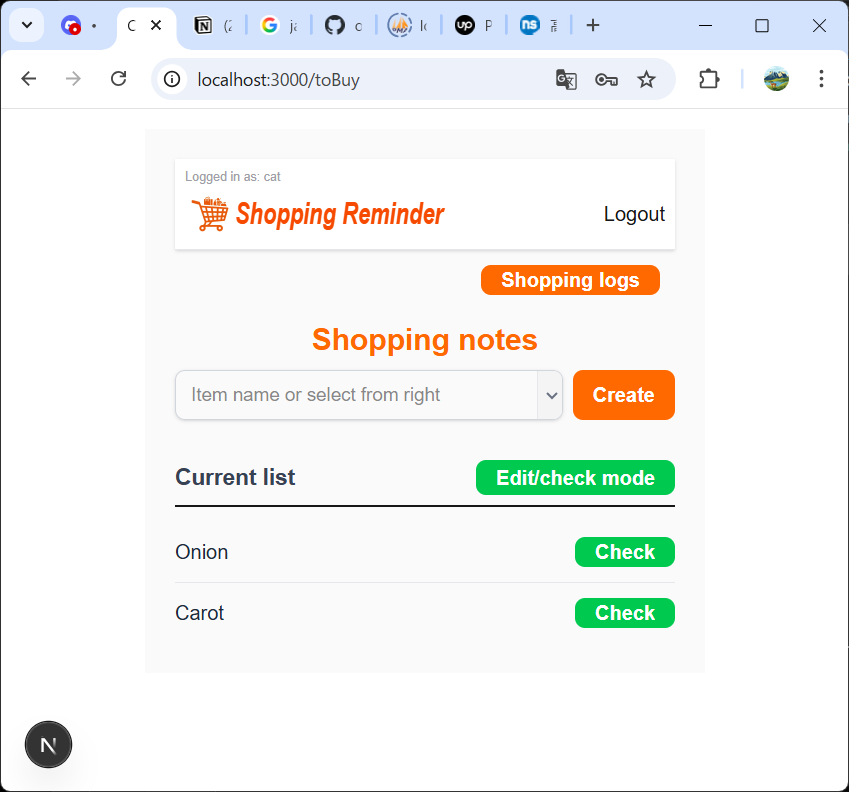

# README＿ENGLISH

# README.md

# Shopping-Reminder

## **Project Name**: shopping-reminder

**GitHub Repository URL :** [https://github.com/oxnut134/shop-rem-eng](https://github.com/oxnut134/shop-rem-eng)

## １)**Project Overview**

Developed as a portfolio project, this ap

plication offers a practical solution to a common daily challenge: forgetting essential items during grocery or household shopping. I designed this app to streamline the shopping experience through a simple yet powerful interface.

① **Mobile-First Design**: Optimized for smartphone use with a compact, two-screen layout that ensures an intuitive user experience.
② **Versatile Utility**: While specifically tailored for daily shopping, the application's robust logic allows it to function  as a streamlined To-Do list manager.

**Key Features**

Users can create shopping lists by entering item names and "check off" items as they are purchased. Completed items are persisted in a database, allowing for easy review of historical records. To enhance operational efficiency (UX), several advanced features were implemented:

- **Smart Input Support**: Includes both manual text entry and predictive pull-down menus based on user history.
- **Dynamic Menu Selection**: Allows users to manage which items appear in the quick-selection menu.
- **Seamless Inline Editing**: Users can edit item names directly on the list without screen transitions. This allows for rapid updates to item details, quantities, or store-specific notes, all confirmed instantly with the **Enter** key.

**Operation Guide**

① **Authentication**: Features standard user registration and secure login functionality.

② **Flexible Data Entry**: Supports manual keyboard input or selection from a pull-down menu. The selection menu is dynamically populated from the history in the "Shopping Logs."

③ **Task Management**: Added items appear in the main list and can be marked as completed via a toggle check button.

④ **Inline Refactoring**: Click any item name to enter edit mode, and press **Enter** to save the changes.

⑤ **Dual-Mode Toggle**:

- The default **"Edit/Check Mode"** allows for routine list management.
- Switching to **"Delete Mode"** enables the removal of specific entries.
- Toggle back to return to the standard operating mode.

⑥ **Purchase History (Shopping Logs)**:

- Access a complete history of past purchases with a single tap.
- **Menu Visibility Toggle**: Within the logs, users can turn on/off the "Menu" flag for each item. Only items flagged as "On" will appear in the quick-selection menu on the main screen, preventing clutter.
- **Smart Grouping**: For duplicate entries, the toggle button is displayed only on the primary entry for a cleaner interface.

---




## **2) Application URL**

**GitHub Repository URL :** [https://github.com/oxnut134/shop-rem-eng](https://github.com/oxnut134/shop-rem-eng)

### **Clone with SSH**

```jsx
bash
git clone git@github.com:oxnut134/shopping-reminder
```

## **3) Feature List**

- Authentication: User Registration, Login, and Logout.
- Inventory Management: Create, Read, Update, and Delete (CRUD) shopping items.
- Purchase History: View historical shopping logs and manage items for the quick-input
menu.

## **4) Tech Stack**

### Frontend

- **Next.js** 15.1.6（Turbopack）
- **React** 19.2.3
- **React-Hook-Form** 7.79.1
- **Axios** 1.7.9

### Backend

- **Laravel** 8.3.24
- **PHP** 8.3.24
- **Nginx** 1.27.5
- **MySQL** 9.0.1
- **Docker** 29.1.5

### Authentication

- **Laravel Breeze** v2.3.8

## **5) Database Schema (Table Design)**


## **6) ER Diagram**


## **7) Environment Setup**

## **7-1) Base Configuration**

This project is built with **Next.js** for the frontend and **Laravel** for the backend. The directory structure is organized under a root shopping-reminder directory, containing dedicated frontend and backend directories to maintain a clean separation of concerns.
The local Git repository is initialized at the root shopping-reminder directory level.

### **Directory Structure**

```
shopping-reminder/
├── backend/        # Laravel (API)
├── frontend/       # Next.js (UI)
├── README.md       # README
├── shopping-reminder.drawio  # ER Diagram(Editable）
└── shopping-reminder.png     # ER Diagram(Image)
```

### Clone The Repository

```jsx
       git clone git@github.com:oxnut134/shopping-reminder
```

## **7-2) Frontend Setup**

### [ Next.js ]

**installation**

```jsx
　　**bash**
    cd frontend
    npm install
　　　　　# This will generate the node_modules directory.
```

**Environment Configuration**

```jsx
　　**bash**
    copy null > .env.local (cmd)
    New-Item .env.local -ItemType File (PowerShell
        # Define your backend URL in .env.local.
        **text**
　　　        NEXT_PUBLIC_BACKEND_URL=http://localhost:8000
```

**Launch Development Server**

```jsx
　　　**bash**
　　　npm run dev
```

## ７－３）Backend **Setup**

### [ Laravel and Docker ]

This project utilizes Docker to provide a consistent development environment for PHP (Nginx) and MySQL.

**Configuration (Root Backend)**
Create and configure ./backend/.env.

```jsx
**bash**
cd backend
copy null > .env (cmd)
New-Item .env -ItemType File (PowerShell)

# Define environment parameters in ./backend/.env
GID=1000
UID=1000
DB_CONNECTION=mysql
DB_HOST=db
DB_PORT=3306
DB_DATABASE=[your DB name]
DB_USERNAME=[your DB user name]
DB_PASSWORD=[your password]

```

**Configuration (Laravel Source)**
Create and configure ./backend/src/.env.

```jsx
**bash**
cd src
copy .env.sample .env (cmd)
Copy-Item .env.example .env (PowerShell)

# Define environment parameters in ./backend/src/.env
DB_CONNECTION=mysql
DB_HOST=db
DB_PORT=3306
DB_DATABASE=[your DB name]
DB_USERNAME=[your DB user name]
DB_PASSWORD=[your password]
```

**Docker Build and Package Installation**

```jsx
**bash**
cd backend
docker compose build
docker compose up -d
docker compose exec app composer install
```

 **APP_KEY generation**
   `docker compose exec app php artisan key:generate`

### [ Database Operations ]

**Migration and Seeding**

```bash
　　**bash**
    docker compose exec app php artisan migrate
    docker compose exec app php artisan db:seed
       # This will generate sample data including items and logs.
```

## **8) Future Roadmap (Postscript)**

While this application was initially designed to prevent forgetting items during grocery shopping, I realized during development that its core logic is highly adaptable. By simply replacing "Item Name" with "Task Name," it functions as a versatile personal reminder for daily life, work, or hobbies.

My immediate plan is to use this current version in a real-world setting to determine the best path forward: whether to pivot towards a **Universal Task Reminder** or to further specialize in **Advanced Shopping Intelligence**.